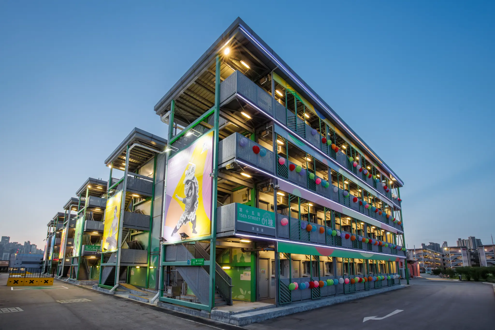

# Runway 1331

A modern, mobile-first web application for **online check-in** and **digital residency passes** at Runway 1331 — a youth development platform in Kai Tak, Hong Kong.

Runway 1331 revitalizes the historic Kai Tak Airport area into a vibrant hub for accommodation, art, culture, sports, music, and creative collaboration.



## Features

- **Online Check-in** — Guests complete a simple form with personal details, nationality, ID/passport, contact info, and estimated arrival time.
- **Digital Pass / Key** — After successful check-in, users receive a beautiful boarding-pass-style digital key featuring:
  - QR code for room access and elevators
  - Room number assignment
  - Guest details and booking reference
- **Trip Timeline** — Visual progress of the stay (Booking Confirmed → Online Check-in → Check-out)
- **Hotel Information** — About the space, full contact details, and list of amenities (creative studios, performance spaces, fitness, co-working, events, etc.)
- **Mobile-Optimized UI** — Designed as a native-feeling mobile experience with a simulated iOS device frame on larger screens and a persistent bottom navigation bar.
- **Persistent State** — Check-in progress is saved in localStorage using Zustand.

## Tech Stack

| Category          | Technologies |
|-------------------|--------------|
| Framework         | React 19 + Vite |
| Language          | TypeScript |
| Styling           | Tailwind CSS + shadcn/ui (Radix primitives) |
| State             | Zustand (with persistence) |
| Routing           | React Router v7 |
| Animations        | Framer Motion |
| QR Codes          | qrcode.react |
| Notifications     | Sonner |
| Forms & Validation| React Hook Form + Zod |
| Icons             | Lucide React |
| Deployment        | Vercel |

## Getting Started

### Prerequisites

- Node.js 20+
- npm (or pnpm/yarn)

### Installation

```bash
# Clone the repository
git clone <your-repo-url>
cd ischool-app

# Install dependencies
npm install
```

### Development

```bash
npm run dev
```

The app will be available at `http://localhost:5173`.

### Build for Production

```bash
npm run build
```

### Preview Production Build

```bash
npm run preview
```

## Project Structure

```
src/
├── components/
│   ├── MobileLayout.tsx   # Device frame + bottom nav
│   └── ui/                # shadcn/ui components
├── lib/
│   ├── store.ts           # Zustand booking state
│   └── utils.ts
├── pages/
│   ├── Home.tsx           # Landing + booking summary
│   ├── CheckIn.tsx        # Check-in form
│   ├── TripStatus.tsx     # Digital pass + QR + timeline
│   └── HotelInfo.tsx      # About + contacts + amenities
├── App.tsx
└── main.tsx
```

## State & Data

All booking data lives in a persisted Zustand store (`useBookingStore`):

- Default booking reference: `RWY-8X92`
- Default stay: 2026-10-15 → 2026-10-18
- On successful check-in, a mock room (`1331-A`) is assigned and status changes to `checked-in`.

The store survives page refreshes via `localStorage`.

## Deployment

The project includes a `vercel.json` for zero-config Vercel deployment.

Recommended deploy command:

```bash
npm run build
```

Simply connect the repository to Vercel (or run `vercel`).

## License

This project is private / for demonstration purposes.

---

**Runway 1331** — Empowering youth through creative collaboration at the former Kai Tak runway.
